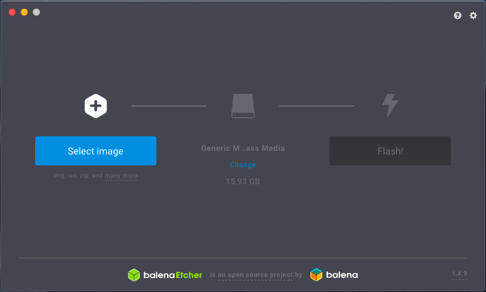
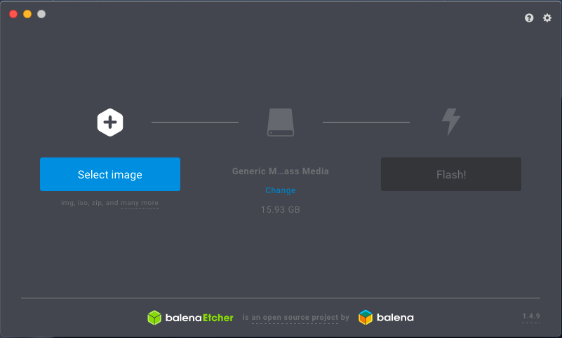

# Création de votre propre T.R.A.S.H. utilisant un Raspberry Pi

Bien qu'il est possible de rouler T.R.A.S.H. à partir de votre ordinateur personnel, nous avons choisi d'utiliser un Raspberry Pi pour sa facilité d'installation et de maintenance.

## Installation de Rapsbian

1. Télécharger la dernière version de (Raspbian Stretch with desktop and recommended software)[https://www.raspberrypi.org/downloads/raspbian/] et décompressez le fichier .zip

2. Télécharger et installer (BalenaEtcher)[https://www.balena.io/etcher/]

3. Insérez la carte microSd dans le lecteur de votre ordinateur

4. Lancez BalenaEtcher

5. Sélectionnez l'image téléchargée et décompressée de l'étape 1 (le fichier .iso)



6. Sélectionnez la carte microSD



7. Cliquez sur Flash!

8. Insérez la carte microSD dans le Raspberry Pi, branchez-y clavier/souris/écran et branchez l'alimentation.

9. Suivez les étapes de cofiguration du Raspberry Pi qui apparaissent au premier démarage (langage, WiFi, etc.)

## Installation du serveur de caméra pour T.R.A.S.H.

Nous avons besoin d'une caméra accessible via HTTP pour que T.R.A.S.H. reconnaisse les Shiny à attraper. Nous alons utiliser Motion.

1. Ouvrez le terminal et tapez les commandes suivantes et tapez `y` lorsque demandé:

```
sudo apt-get update
sudo apt-get install -y motion
```

2. Une fois installé avec succès, nous alons configurer Motion. Entrez la commandes suivante pour éditer la configuration:

```
sudo nano /etc/motion/motion.conf
```

3. Trouvez la ligne `daemon off` et changez-la pour `daemon on`

4. Trouvez la ligne `stream_localhost on` et changez-la pour `stream_localhost off`

5. Enregistrez et quittez Nano (CTRL + X)

6. On a un autre ficher à configurer pour que Motion démarre en même temps que le Raspberry Pi :

```
sudo nano /etc/default/motion
```

7. et changez la ligne `start_motion_deamon=no` pour `start_motion_deamon=yes`, puis sauvegardez et quittez.

8. Branchez votre webcam

9. Démarrez le serveur de caméra avec:

```
sudo service motion start
```

9. Vérifiez que le tout foncitonne en lançant dans votre navigateur [http://localhost:8080]. Vous devriez voir l'image de la caméra

## Installation de T.R.A.S.H.

On va devoir installer des outils pour le langage de programmation Ruby, qui va rendre la gestion du projet plus facile

1. On installe les dépendances du projet

```
sudo apt-get install -y autoconf bison build-essential libssl-dev libyaml-dev libreadline6-dev zlib1g-dev libncurses5-dev libffi-dev libgdbm5 libgdbm-dev yarn
```

2. On installe Ruby via `asdf` :

```
git clone https://github.com/asdf-vm/asdf.git ~/.asdf --branch v0.7.0
echo -e '\n. $HOME/.asdf/asdf.sh' >> ~/.bashrc
echo -e '\n. $HOME/.asdf/completions/asdf.bash' >> ~/.bashrc
source ~/.bashrc

asdf plugin-add ruby
asdf install ruby 2.6.0  # Cette étape peut prendre beaucoup de temps. C'est normal
gem install bundler
```

2. On installe l'utilitaire qui permet d'analyser l'image:

```
sudo apt-get install -y imagemagick libmagickwand-dev
```

3. On clone le projet:

```
git clone https://github.com/sophiedeziel/robo-catcher.git

cd robo-catcher
bundle exec bin/setup
```

4. Le tout devrait fonctionner!
